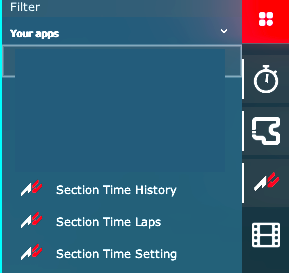
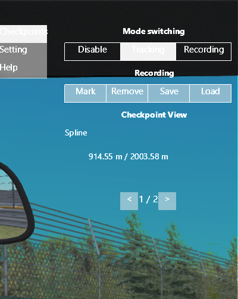
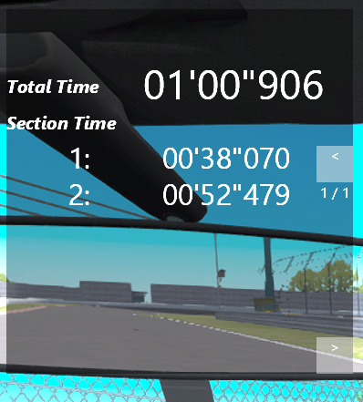
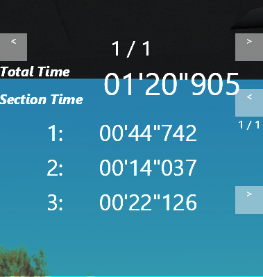
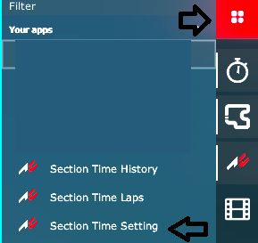
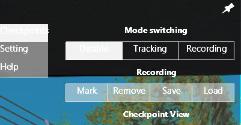
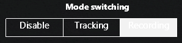
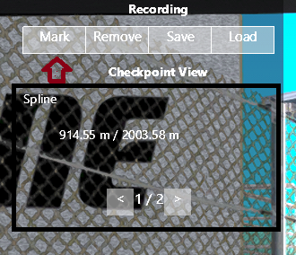
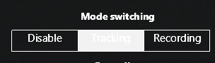

# Sector Time Recorder

セクションタイムを計測するためのAssetto Corsa のModです。

## What's this Mod for?

Assetto Corsa では、様々な製作者が様々なTrackを公開してくれています。
お気に入りのTrackがあれば、もっと上手くなって、もっと速く走らせてみたいと思うでしょう。
Lap Timeを比較しても、うまい人と自分との差がどこにあるかはわからないものです。
もしかしたら、第3コーナーの処理がよくなかったのか、それともバックストレートの加速が弱かったのか、
その原因がわからないでしょう。原因を見つけるにはSection Timeの計測が必要です。

しかし、多くのTrackにはほしいところでセクションタイムの測定ができるようにはなっていません。
このModを導入すると、そんなTrackを走るときに自由にセクションを設定し、セクションタイムを測定することができるようになります。

## How to Install ?

### Prerequestition

- [Contents Manager](https://assettocorsa.club/content-manager.html)
- [Custom Shader Patch](https://acstuff.ru/patch/)
  - version 2.11 or higher

各アイテムのインストールはそれぞれのサイトを参照してください。  

### Installation

1. **最新版のSection Time Recorderをダウンロードします**
2. **Contents Manager を使ってインストールします**
3. **Contents Manager の appsで Section Time Recorderにチェックを入れます**

## What's included

Assetto CorsaをContents Managerから開始して、アプリケーションの一覧から開くことができます。

Section Time Recorder は 3つのアプリケーションから成り立ちます。

- **Section Time Setting**

  Section Time Recorderを設定するためのアプリケーションです。
  セクションの設定はこのアプリケーションから行います。

  

- **Section Time Laps**

  現在のLapにおける合計時間とセクションタイムを表示するためのアプリケーションです。

  

- **Section Time History**

  過去のLapの合計時間とセクションタイムを表示するためのアプリケーションです。

  

## How to use ?

### 1. 設定アプリを見てみましょう

アプリの一覧から**Section Time Setting**を開きます。

`Checkpoints` > `Mode switching` のボタンで現在のモードを切り替えることができます

各種モードは次のような意味を持ちます。

- `Disable`

  アプリの機能を無効にします。この状態ではセクションタイムの設定や測定は行いません。
  初期状態はこ`Disable`になっています。

- `Tracking`

  設定されているセクションに基づいてセクションタイムの測定を行います。
  この状態ではセクションタイムの設定はできません。

- `Recording`

  セクションの設定を行います。この状態で、`Recording` の各種ボタンをクリックすることで
  セクションを追加、削除したり、ファイルに保存、ロードしたりすることができます。
  この状態ではセクションタイムの測定は行いません。

セクションの設定をするために`Recording`に変更してください。

### 2. 車を走らせながら、セクションを設定する

いつも通り（といっても、設定しやすいようにゆっくり）車を走らせます。

希望の距離走らせたら、`Mark` をクリックしてセクションとしてマークします。
マークすると、`Checkpoint View` に設定したセクションが追加され表示されていきます。
もし削除したい場合は、`Checkpoint View` に セクションを表示した状態で`Remove`をクリックします。

セクションを編集し終わったら、`Tracking` にします。

**Setion Time Laps** と、必要に応じて **Section Time History** を開いておきましょう。

### 3. Start tracking

`Tracking` の状態のまま、次のLapを開始します。
Trackを一周するか、(峠の場合)ピットに戻ります。
スタートラインを越えた瞬間から、計測を開始します。

## 